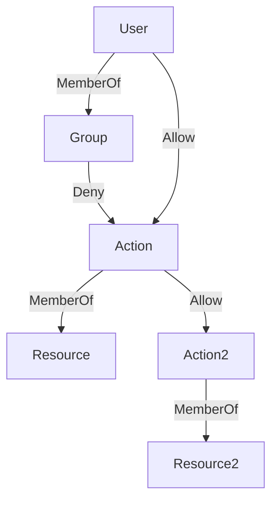

# permission-graph

A graph based authorization library

## Overview

The permissions graph consists of Vertices and Edges.

**Vertices**

* `Resource`: a resource with predefined actions requiring authorization
* `User`: an identity that will take actions on resources
* `Group`: a named collection of `Users`
* `Action`: an action on a resource

**Edges**

* `MemberOf`: indicates membership in a collection
    - `User -> MemberOf -> Group`
    - `Action -> MemberOf -> Resource`
* `Allow`: indicates positive permission to act on a resource
    - `User -> Allow -> Action`
    - `Group -> Allow -> Action`
    - `Action -> Allow -> Action`
* `Deny`: indicates negative permission to act on a resource
    - `User -> Deny -> Action`
    - `Group -> Deny -> Action`
    - `Action -> Deny -> Action`

### Authorizing Access

Authorization to act on a resource is decided by finding the shortest path between
a user and the action to be performed. If that shortest path is an ALLOW rule, 
the user is authorized. If that shortest path is a DENY rule, or if there is no
path between the user and the action, the user is not authorized.

In the event there is a tie for shortest path, the access will be denied only
if all shortest paths are DENY rules. This behavior can be controlled when
initializing the permission graph via the `tie_breaker_policy` parameter.
