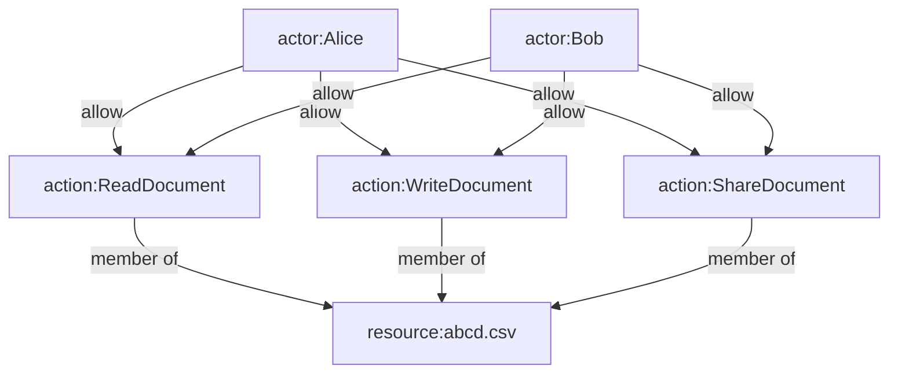
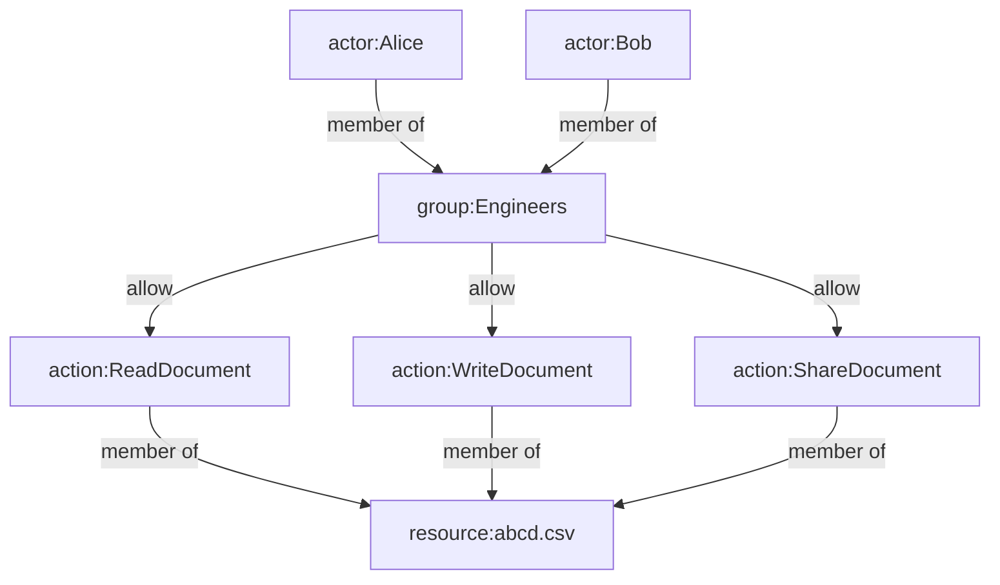
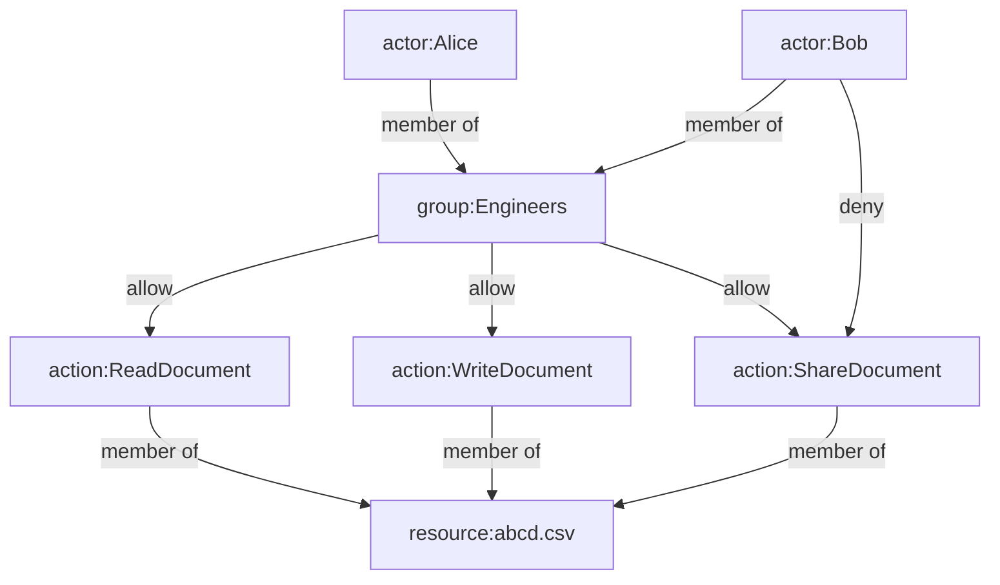

Permission-graph provides an authorization framework for granular access control.

## Getting started

Fundamentally, permission-graph helps authorize **Actors** to take **Actions**
on **Resources**. Take the following example of a actor named Alice, where we
grant her full access to the document "abcd.csv".

=== "Diagram"
    ```mermaid
    flowchart
        alice[actor:Alice]
        document[resource:abcd.csv]
        read[action:ReadDocument]
        write[action:WriteDocument]
        share[action:ShareDocument]

        read-->|member of|document
        write-->|member of|document
        share-->|member of|document

        alice-->|allow|read
        alice-->|allow|write
        alice-->|allow|share
    ```

=== "Python"
    ```python
    from permission_graph import (
        PermissionGraph,
        Actor,
        Resource,
        ResourceType,
        Action
    )

    # Set up graph
    pg = PermissionGraph()
    document_type = ResourceType(
        "Document", 
        actions=[
            "ViewDocument", 
            "EditDocument",
            "ShareDocument"
        ]
    )
    pg.register_resource_type(document_type)

    # Create actor
    alice = Actor("Alice")
    pg.add_actor(alice)

    # Create document
    document = Resource("abcd.csv", resource_type=document_type)
    pg.add_resource(document)

    # Grant permissions on document
    pg.allow(alice, Action("ViewDocument", document))
    pg.allow(alice, Action("EditDocument", document))
    pg.allow(alice, Action("ShareDocument", document))
    assert False
    ```


First, an empty `PermissionGraph` is created, using the default in-memory 
backend built on igraph.

We define a `ResourceType` named "Document", with three actions:

- `ViewDocument`
- `EditDocument`
- `ShareDocument`

Any resource we create with this Document type will support those three actions.

We then create an `Actor` with an id "Alice". An Actor is an entity that will
act on resources. It could represent a human user, as in this example,
or a service/machine.

Finally, we create a document `Resource` named "abcd.csv", and grant Alice
permission to View, Edit, and Share the document. All actions are prohibited 
unless explicitly granted.


When it is time to authorize an Actor to perform some Action, the 
`action_is_authorized` method can be used.

```pycon
>>> pg.action_is_authorized(alice, Action("ShareDocument", document))
True
```

## Groups

Groups are used to share permissions with many users.

Continuing from the example above, say we add another user named Bob whom
we also wish to have full access to the `asdf.csv` document. 

One way to accomplish this is to add the same permissions that we did for Alice.



This works fine for two actors, but at some point it's not scalable to manage
each actor's access to every resource individually. Consider if Alice and Bob
belonged to a group named "Engineers".



## Deny Permissions

We've already seen two of the three supported edge types in permission-graph:

- `MEMBER_OF`: Indicates one vertex is a member of another (e.g. an actor is a member of a group)
- `ALLOW`: Indicates one vertex is allowed to perform some action

The third edge type is `DENY`, which is analagous to `ALLOW` but explicitly does not
allow an actor to perform some action.

To understand why this is useful, we continue from our example above. Bob and
Alice both belong to the Engineers group, which grants them full access to 
the "abcd.csv" document.

But what if we wanted to revoke Bob's permission to share the document with
others? One approach is to go back to managing each actor's permisisons
individually.

However, we can also use a `DENY` edge to accomplish the same end, while keeping
our graph lean.



There are two valid paths from Bob to the `ShareDocument` permission. 

- Bob --> Engineers --(allow)-> ShareDocument
- Bob --(deny)-> ShareDocument

Through his membership in the Engineers group, he is allowed to share the document. However,
the most direct path between Bob and the document denies access, so Bob will not
be allowed to share the document with others.

This example demonstrates a key principle of permission-graph: **The most direct
permission wins**.